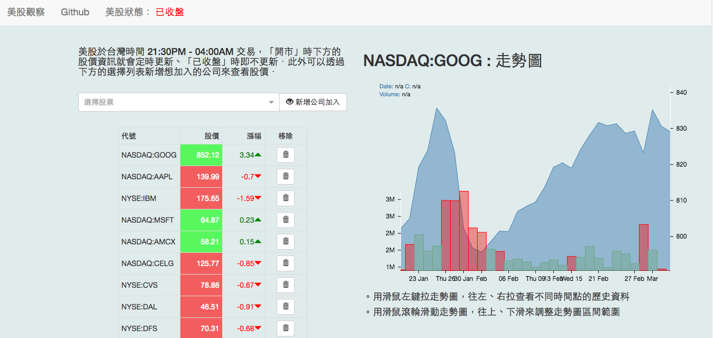
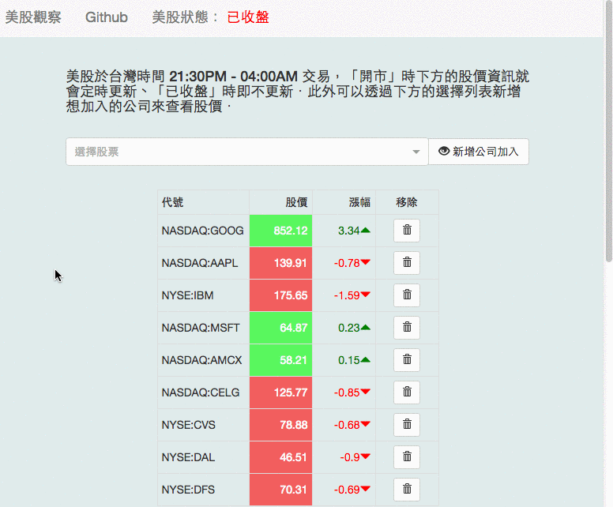
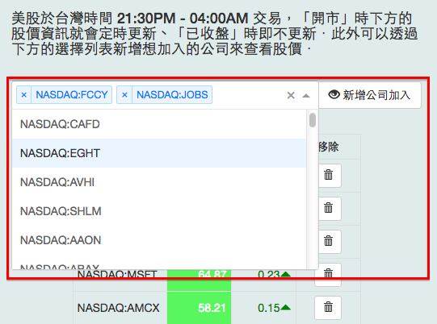
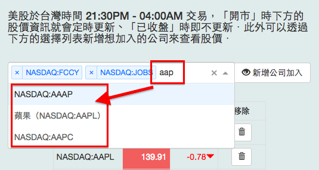
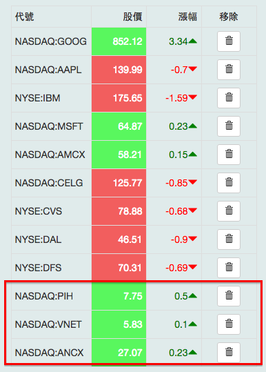
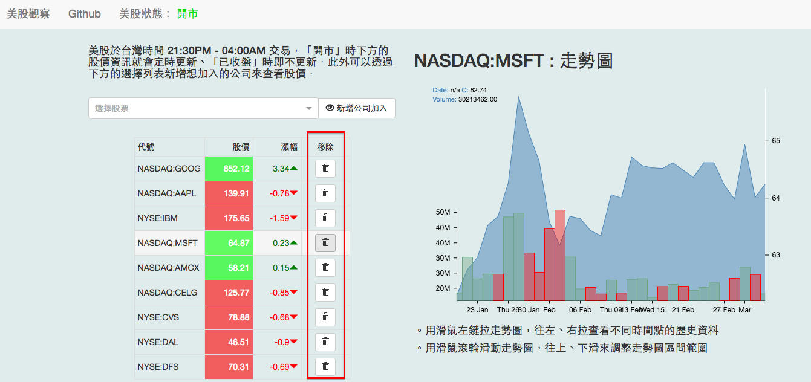
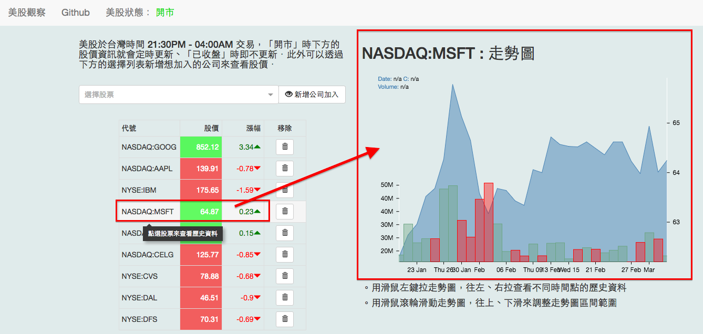
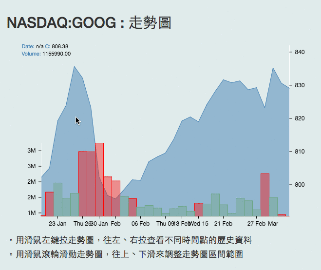

# react_stocks_example

用 `Node.js`、`React` 建立一個看股票的應用，相關技術與資源：`Node.js(express)`、`React`、`socket.io`、`Webpack`、`bootstrap`、`font-awesome`、`react-stockcharts(D3.js)`、`google-finance`、`google-stocks`、`react-select`，並且參考了 Christophe Coenraets 的作品的畫面設計[react-trader](https://github.com/ccoenraets/react-trader)

## [demo](http://35.163.223.176/) <--

 ## 畫面截圖

 ## 響應式頁面

## 選擇想要看的股票（這邊我只列了那斯達克證券交易所的列表）

 

## 也可以自己輸入來找出相關的股票代碼

  

## 加入以後會加入下方表格   

  

## 左邊的「移除」按鈕點選就能移除不看的股票

 ## 點選股票可以查看該股票的近年走勢圖

 ## 利用滑鼠操作走勢圖(react-stockcharts(D3.js))

